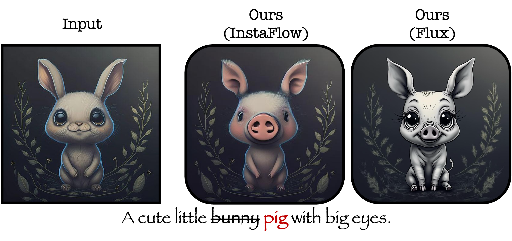
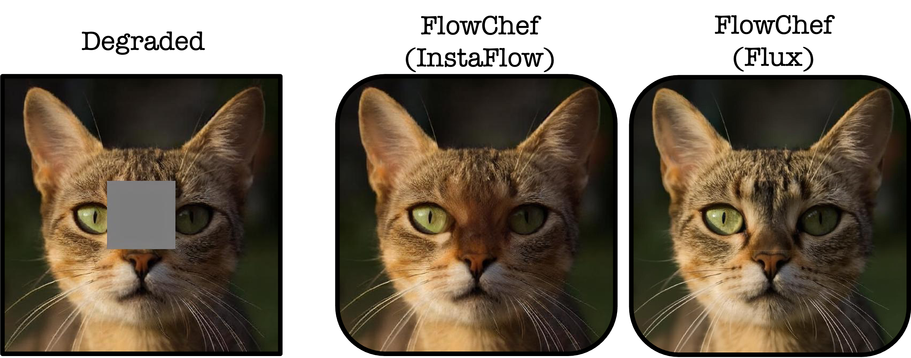

## 🚀 🚀 Steering Rectified Flow Models in the Vector Field for Controlled Image Generation

<div align="center">
  <a href="https://flowchef.github.io/"></a> &ensp;
  <a href="https://arxiv.org/abs/2412.00100"></a> &ensp;
  <a href="https://huggingface.co/spaces/FlowChef/FlowChef-Flux1-dev"></a> &ensp;
  <a href="https://huggingface.co/spaces/FlowChef/FlowChef-InstaFlow-Edit"></a> &ensp;
  <a href="https://huggingface.co/spaces/FlowChef/FlowChef-InstaFlow-InverseProblem-Inpainting"></a> &ensp;
</div>


<div align="center">
  <video src="https://github.com/user-attachments/assets/c0ac474d-726a-4003-8b9f-4ff32a400d82" autoplay muted loop playsinline style="width: 50%;"></video>
</div>


**FlowChef** introduces a novel approach to steer the rectified flow models (RFMs)  for controlled image generation for inversion-free, gradient-free, and training-free navigation of denoising trajectories. Unlike diffusion models, which demand extensive training and computational resources, **FlowChef** unifies tasks like **classifier guidance, inverse problems, and image editing** without extra training or backpropagation. **FlowChef** sets new benchmarks in performance, memory, and efficiency, achieving state-of-the-art results.

***We extend the FlowChef on Flux.1[dev] for image editing and inverse problems.*** 


## 🔥 Updates

- **[2025.06.07]** Support for rectified-diffusion to solve inverse problems added.
- **[2025.03.15]** Scripts for gradio demo are provided in this repo.
- **[2024.11.29]**  All working demos are released on [HuggingFace](https://huggingface.co/FlowChef)!

## TODOs

- [ ] Extend the FlowChef to the video models.
- [ ] (top-priority) Release the support for [Inductive Moment Matching](https://github.com/lumalabs/imm) for inverse problems.
- [ ] (low-priority) Release the diffusion baselines.
- [x] ~~Release CLI scripts for the image editing.~~
- [x] ~~Release the latent-space inverse problem benchmark script.~~
- [x] ~~Release the pixel-space inverse problem benchmark script (with baselines)~~
- [x] ~~Release the organized demo scripts~~
- [x] ~~Release the Flux.1[dev] demo~~
- [x] ~~Release the InstaFlow demo~~

## FlowChef Setup (Flux & InstaFlow)

Follow below instructions to setup the FlowChef for SOTA latent space models like Flux.1[Dev] for image editing and inverse problems.

```bash
# Clone the repository
# alternatively manually download the codebase
git clone https://github.com/FlowChef/FlowChef.git

# Create a new conda environment
conda create --name flowchef_env python=3.10 -y

# Activate the conda environment
conda activate flowchef_env

# Install the required dependencies
pip install -e .
```

By following these steps, you will have a conda environment set up and ready to run the image editing & gradio `demos`.

## Instructions for Image Editing

<p align="center">
  
</p>

Although we recommend using the gradio demo for image editing, below we show how to perform editing using CLI.

> While our current implementation requires manually annotated masks, we have successfully integrated [ConceptAttention](https://github.com/helblazer811/ConceptAttention) with FlowChef on Flux to enable fully automatic, annotation-free editing. This enhancement will be released by March 21st, 2025, significantly streamlining the editing workflow using FlowChef.


Follow below instructions to perform image editing on Flux.1[Dev] and InstaFlow models. If it does not give desired result then we suggest to play with the hyperparameters.

```bash
# Using Flux.1[Dev] (~30 seconds on A100)
python ./src/flux_edit.py \
    --input_image ./assets/saved_results/20241126_223719/input.png \
    --mask_image ./assets/saved_results/20241126_223719/mask.png \
    --prompt "a cat" \
    --edit_prompt "a tiger" \
    --num_inference_steps 30 \
    --max_steps 30 \
    --learning_rate 0.6 \
    --max_source_steps 10 \
    --optimization_steps 5 \
    --true_cfg 4.5

# Using InstaFlow (~3 seconds on A100)
python ./src/instaflow_edit.py \
    --input_image ./assets/saved_results/20241129_195331/input.png \
    --mask_image ./assets/saved_results/20241129_195331/mask.png \
    --prompt "a cat" \
    --edit_prompt "a silver sculpture of cat" \
    --num_inference_steps 50 \
    --max_steps 50 \
    --learning_rate 0.5 \
    --max_source_steps 20 \
    --optimization_steps 5 \
    --true_cfg 2.0
```


## Instructions for Inverse Problems

<p align="center">
  
</p>

FlowChef provides support for solving inverse problems using models with more direct trajectories, specifically Rectified-Diffusion and InstaFlow. Our experiments demonstrate that Rectified-Diffusion achieves exceptional performance that rivals state-of-the-art approaches in this domain.

We find that a major computational bottleneck in existing methods stems from the Variational Autoencoders (VAEs). Rather than attempting to resolve this limitation, our focus is on exploring and leveraging the elegant theoretical properties of pure diffusion and flow models that follow straight trajectories. Needless to say that by incorporating better VAE tricks (from prior works) will improve the FlowChef further.


Run following command to test inverse problems using FlowChef without backpropagation.
Importantly, this is first step towards the gradient-free solution however latent space of VAE and VAE itself could add unwanted non-linearity.
Therefore, as outlined in the paper, inference is lightning fast but may not be the SOTA all the time.

Supported opetators: `inpaint`, `super`, `deblur`

### InstaFlow:

```bash
# hyperparameters for super resolution and deblurring
python ./src/instaflow_inverseproblems.py \
        --input_dir ./assets/inverseproblems/ \
        --operation super \
        --random_seed --learning_rate 0.02 --max_steps 100 --num_inference_steps 100

# hyperparmaeters for box inpainting
python ./src/instaflow_inverseproblems.py \
        --input_dir ./assets/inverseproblems/ \
        --operation inpaint \
        --random_seed --learning_rate 0.5 --max_steps 200 --num_inference_steps 200
```

### Rectified-Diffusion:

```bash
# download the model
mkdir -p ./checkpoints/ && wget -c https://huggingface.co/wangfuyun/Rectified-Diffusion/resolve/main/weights/rd.ckpt -P ./checkpoints/

# hyperparmaeters for box inpainting (~6 secs)
python ./src/rectifiedd_inverseproblems.py \
        --input_dir ./assets/inverseproblems/ \
        --operation inpaint \
        --random_seed --learning_rate 0.2 --max_steps 100 --num_inference_steps 100 --optimization_steps 4

# hyperparameters for super resolution and deblurring (~90 secs)
python ./src/rectifiedd_inverseproblems.py \
        --input_dir ./assets/inverseproblems/ \
        --operation super \
        --random_seed --learning_rate=0.5  --num_inference_steps=100 --optimization_steps 10

```

The results will be stored in `./outputs` folder. Many Flow model based baselines does not work very well at all despite compute intensive backpropagation.
We refer reders to [PSLD-LDM](https://github.com/LituRout/PSLD) and [Resample](https://github.com/soominkwon/resample) for diffusion base approaches.
Additionally, we do not add any manifold regularizers or learning rate scheduler.
But we found that (espeically, learning rate scheduler) doing so helps model perform much better.

### Pixel model (RF++): `inverseproblems/pixel_models/rfpp`

[This folder](inverseproblems/pixel_models/rfpp) contains the code for solving inverse problems using RF++ models. We provide scripts for various baselines and our FlowChef approach.

For detailed instructions on:
- Setting up pretrained checkpoints
- Downloading test datasets 
- Running inference for different inverse problems (box inpainting, super resolution, deblurring)
- Evaluating baselines (DFlow, OTODE, DPS, FreeDoM) and FlowChef

Please refer to the detailed README in the [`inverseproblems/pixel_models/rfpp`](inverseproblems/pixel_models/rfpp/README.md) directory.

Note: The current implementation supports AFHQ-Cat and CelebA datasets. Support for ImageNet and higher resolutions (up to 256x256) will be released soon. Alternatively for these use cases, please check our latent model solutions.


## **Running the Gradio Demos**

Once the environment is set up, you can run the following demos:

1. **Flux Editing and Inpainting (Inverse Problem):**

    ```bash
    gradio demos/app_flux.py
    ```

2. **InstaFlow Editing:**

    ```bash
    gradio demos/app_instaflow_edit.py
    ```

3. **InstaFlow Inpainting (Inverse Problem):**

    ```bash
    gradio demos/app_instaflow_ip_inpaint.py
    ```


## Citation
```
@article{patel2024flowchef,
        title={Steering Rectified Flow Models in the Vector Field for Controlled Image Generation},
        author={Patel, Maitreya and Wen, Song and Metaxas, Dimitris N. and Yang, Yezhou},
        journal={arXiv preprint arXiv:2412.00100},
        year={2024}
      }
```

## Ackowledgement

MP and YY are supported by NSF RI grants \#1750082 and \#2132724.  We thank the Research Computing (RC) at Arizona State University (ASU) and [cr8dl.ai](cr8dl.ai) for their generous support in providing computing resources. The views and opinions of the authors expressed herein do not necessarily state or reflect those of the funding agencies and employers.

We also acknowledge the authors of the Flux and InstaFlow models, along with HuggingFace, for releasing the models and source codes. 
